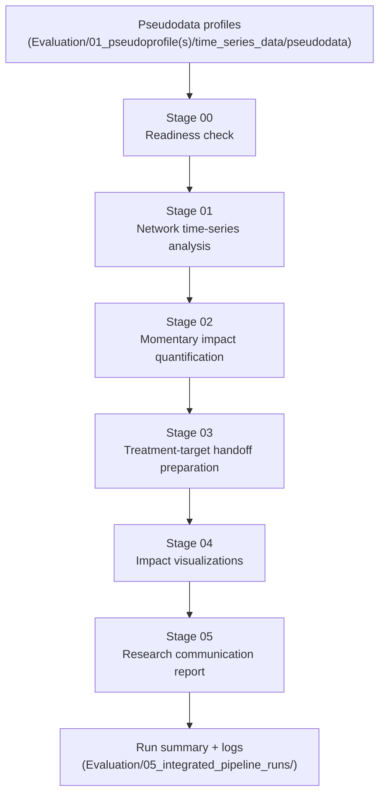

# Integrated Pipeline

This module is the standardized runner for the thesis analysis chain from pseudodata to ranked treatment-target handoff candidates.

## Entry Point

- `run_pipeline.py` (future-ready mode router)
- `run_pseudodata_to_impact.py`

## Workflow



## Readiness-Aligned Execution Logic

- `Tier3 + TIME_VARYING_gVAR` → run tv-gVAR + stationary gVAR + correlation baseline.
- `Tier3 + STATIC_gVAR` → run stationary gVAR + correlation baseline (no tv-gVAR).
- `Tier2` → run contemporaneous/correlation baseline set.
- `Tier1` → run correlation-only baseline.
- `Tier0` → descriptive outputs only.

`FullyReady` is reserved for cases where full time-varying gVAR is executable.

## Stage Outputs

- `00_readiness_check/` → `readiness_report.json`, `readiness_summary.txt`
- `01_time_series_analysis/network/` → network analysis outputs and metrics
- `02_momentary_impact_coefficients/` → `predictor_composite.csv`, `momentary_impact.json`
- `03_treatment_target_handoff/` → `top_treatment_target_candidates.csv` / `.json`
- `04_impact_visualizations/` → visualization summary + profile visuals index
- `05_research_reports/` → `run_report.md`, `run_report.json`, component/profile CSV summaries
- `logs/` → stage logs + `pipeline.jsonl`
- `pipeline_summary.json` → machine-readable run manifest

## Quick Start

```bash
python Evaluation/00_pipeline_orchestration/run_pipeline.py --mode synthetic_v1
```

Run a smaller smoke test:

```bash
python Evaluation/00_pipeline_orchestration/run_pipeline.py --mode synthetic_v1 \
  --pattern pseudoprofile_FTC_ID002 \
  --max-profiles 1 \
  --network-boot 10
```

Reuse existing outputs while skipping stages:

```bash
python Evaluation/00_pipeline_orchestration/run_pseudodata_to_impact.py \
  --skip-readiness \
  --readiness-source-root "<existing_readiness_root>" \
  --skip-network \
  --network-source-root "<existing_network_root>"
```
