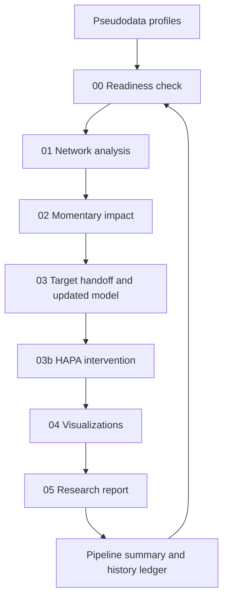

# Integrated Pipeline Orchestration

Standardized runner for PHOENIX stage execution on synthetic profiles.

## Entrypoints

- `run_pipeline.py`: mode-router and preferred integration entry.
- `run_pseudodata_to_impact.py`: detailed pipeline driver.

## Stage Flow



## Readiness-Aligned Method Policy

- Tier3 + `TIME_VARYING_gVAR`: tv-gVAR + stationary gVAR + baseline.
- Tier3 + `STATIC_gVAR`: stationary gVAR + baseline.
- Tier2: reduced baseline set.
- Tier1: correlation-first baseline.
- Tier0: descriptive outputs only.

`FullyReady` is reserved for profiles where full tv-gVAR is executable.

## Iterative Closed Loop

When iterative memory is enabled (`--cycles > 1`), each new cycle builds `_iterative_cycle_input/` from prior-cycle outputs:
- Step-04 updated predictor/criterion selection,
- Step-05 selected treatment targets and linked criteria,
- recent profile-level impact and ranking evidence.

The next cycle then reruns readiness and network analysis on this updated cycle-specific dataset.

## Quick Commands

```bash
python Evaluation/00_pipeline_orchestration/run_pipeline.py --mode synthetic_v1
```

```bash
python Evaluation/00_pipeline_orchestration/run_pipeline.py --mode synthetic_v1 \
  --pattern pseudoprofile_FTC_ID002 --max-profiles 1 --network-boot 10
```

```bash
python Evaluation/00_pipeline_orchestration/run_pipeline.py --mode synthetic_v1 \
  --hard-ontology-constraint --handoff-critic-max-iterations 2 --intervention-critic-max-iterations 2
```
