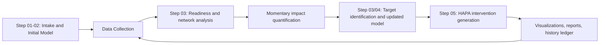

# PHOENIX Engine

Research-grade software for the Ghent University master’s thesis on personalized, iterative mental-health optimization.

## Academic Context

- **Institution:** Ghent University
- **Author:** Stijn Van Severen
- **Supervisors:** Geert Crombez, Annick De Paepe

## What PHOENIX Does

PHOENIX (Personalized Hierarchical Optimization Engine for Navigating Insightful eXplorations) operationalizes mental-state support as an iterative data-analysis and decision-support workflow:

1. operationalize free-text complaints into measurable criterions,
2. build an initial criterion-predictor observation model,
3. run readiness-aware time-series analysis,
4. quantify predictor momentary impact,
5. identify treatment targets,
6. construct an updated observation model,
7. generate a HAPA-based digital intervention,
8. produce standardized visual and research communication artifacts.

The repository currently uses synthetic pseudodata and is structured for future frontend/backend real-data integration.

## Frontend (Flask Debug UI)

A session-based Flask frontend is available for interactive execution and live process monitoring:

```bash
python frontend/app.py
```

Then open [http://127.0.0.1:5050](http://127.0.0.1:5050).

The UI supports:
- complaint/person/context intake,
- Step 01→02 model creation with streamed logs,
- variable-level data-collection schema inspection,
- pseudodata synthesis or manual CSV upload,
- iterative cycle execution with full PHOENIX stage logging.

You can launch this UI directly from the pipeline launcher:

```bash
python evaluation/00_pipeline_orchestration/run_pipeline.py --ui
```

## Repository Structure

```text
MASTERPROEF/
├── src/
│   ├── SystemComponents/
│   │   ├── Agentic_Framework/
│   │   ├── Hierarchical_Updating_Algorithm/
│   │   └── PHOENIX_ontology/
│   ├── overview/
│   └── utils/
├── evaluation/
│   ├── 00_pipeline_orchestration/
│   ├── 05_integrated_pipeline_runs/
│   ├── 06_quality_assurance/
│   └── 07_research_communication/
├── frontend/
├── .github/workflows/
├── pyproject.toml
├── requirements.txt
└── requirements-dev.txt
```

## Quick Start

Run the integrated synthetic pipeline:

```bash
python evaluation/00_pipeline_orchestration/run_pipeline.py --mode synthetic_v1
```

Run iterative cycles with memory:

```bash
python evaluation/00_pipeline_orchestration/run_pipeline.py --mode synthetic_v1 --cycles 2 --profile-memory-window 3
```

In iterative mode, each cycle returns to the readiness/network-analysis stage using the updated observation model and persisted run history.
The orchestrator now generates cycle-specific pseudodata windows from prior-cycle Step-04/Step-05 artifacts, so updated models directly influence the next analysis pass.

Run with stricter ontology and guardrails:

```bash
python evaluation/00_pipeline_orchestration/run_pipeline.py --mode synthetic_v1 \
  --hard-ontology-constraint \
  --handoff-critic-max-iterations 2 \
  --intervention-critic-max-iterations 2
```

Run deterministic fallback mode (LLM disabled where supported):

```bash
python evaluation/00_pipeline_orchestration/run_pipeline.py --mode synthetic_v1 --disable-llm
```

`--disable_LLM` is supported as an alias for compatibility with existing scripts.

## Pipeline Overview



## Quality Assurance

```bash
make qa-unit
make qa-integration
```

- CI workflow: `.github/workflows/ci.yml`
- Smoke workflow: `.github/workflows/smoke_pipeline.yml`
- Contract validation entrypoint: `evaluation/06_quality_assurance/validate_contract_schemas.py`

## LLM Reliability and Fallbacks

- Shared runtime supports retry, bounded auto-repair, and structured validation.
- Error classes are explicit (provider, schema, repair, budget).
- Actor-critic loops are available in Step-03/04/05.
- `--hard-ontology-constraint` enforces ontology-matched outputs across key decisions.
- If LLM execution is unavailable, pipeline outputs remain schema-valid and include:
  - `Limitation recorded: LLM unavailable, so it’s impact-driven only.`

## Data and Security Hygiene

- `.env`, secrets, caches, and heavy generated artifacts are excluded by `.gitignore`.
- Ontology content remains versioned and protected.
- Large generated run outputs are intentionally kept out of version control.

## License

`GPL-3.0` (see `LICENSE`).
