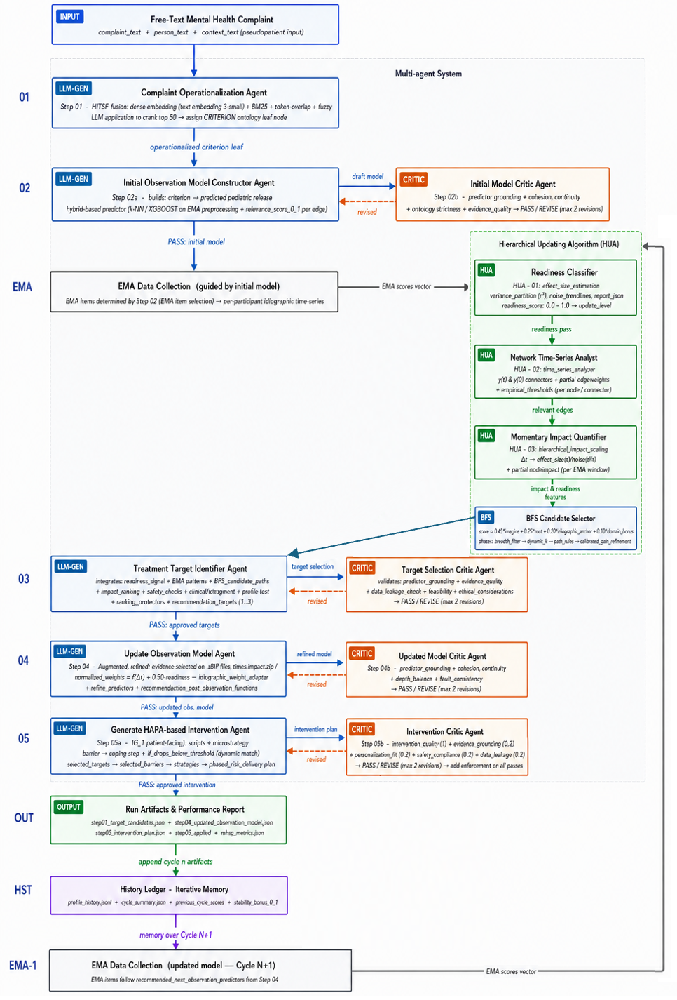
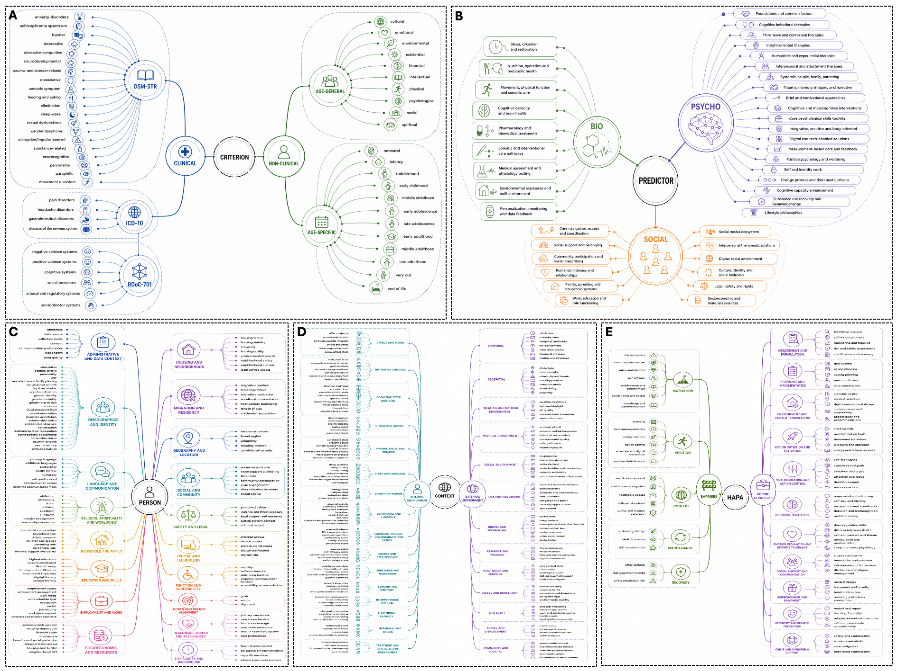

<div align="center">

  <h1>🐦‍🔥 PHOENIX Engine</h1>

  <p>The PHOENIX engine conceptualises mental health support as a closed-loop workflow that iteratively optimizes the digital intervention proposal based on multi-modal data from previous collection cycles.</p>

  <p>
    <a href="#"></a>
    <a href="#"></a>
    <a href="#"></a>
    <a href="#"></a>
  </p>

</div>

---

## 📋 Table of Contents

- [📄 Abstract](#abstract)
- [🔁 End-to-End Stage Map](#end-to-end-stage-map)
- [🐦‍🔥 PHOENIX Ontology](#phoenix-ontology)
- [🚀 Quick Setup](#quick-setup)
- [🗂️ Repository Structure](#repository-structure)
- [💻 Run from CLI](#run-from-cli)
- [🖥️ Run from Frontend](#run-from-frontend)
- [📦 Outputs and Validation](#outputs-and-validation)
- [✅ Quality Assurance and CI/CD](#quality-assurance-and-cicd)
- [📜 License](#license)

---

<a id="abstract"></a>

## 📄 Abstract

Longitudinal mental health applications collect rich person-specific data, yet translating those data into concrete, personalized intervention decisions remains difficult. PHOENIX addresses this gap with an adaptive approach to idiographic modelling that is built on ontology-based multi-agentic workflows. Starting from a free-text complaint, the engine operationalizes the problem into measurable criteria, constructs an initial observation model, analyses the resulting time-series dynamics, identifies biopsychosocially balanced treatment targets, and generates a digital intervention grounded in the Health Action Process Approach (HAPA). Five sub-ontologies (CRITERION, PREDICTOR, PERSON, CONTEXT, HAPA) constrain every reasoning step, and each generative actor is paired with a critic agent that keeps outputs bounded and auditable. Because the output of each cycle seeds the next, PHOENIX operates as a closed loop in which the weighting of idiographic and nomothetic evidence adapts as more person-specific data become available.

---

<a id="end-to-end-stage-map"></a>

## 🔁 End-to-End Stage Map

PHOENIX is a modular, multi-agent system that starts from a free-text mental-health complaint, builds an initial observation model, analyses idiographic time-series dynamics through the Hierarchical Updating Algorithm (HUA), proposes biopsychosocially-balanced treatment targets, generates a HAPA-grounded digital intervention, and packages iterative updates for the next cycle. Every generative actor stage is paired with a critic agent that issues a bounded PASS / REVISE decision on a weighted composite score, which gives the full pipeline an auditable trail without sacrificing generative flexibility.



---

<a id="phoenix-ontology"></a>

## 🐦‍🔥 PHOENIX Ontology

Five sub-ontologies constrain all reasoning and output structure across the PHOENIX pipeline: (1) **CRITERION** (i.e., mental health problem space: DSM-5TR, ICD-10, RDoC-701, non-clinical wellbeing), (2) **PREDICTOR** (i.e., intervention solution space: BIO / PSYCHO / SOCIAL branches), (3) **PERSON** (i.e., stable individual-level attributes across 18 domains), (4) **CONTEXT** (i.e., dynamic situational states: internal and external environment), and (5) **HAPA** (i.e., behaviour change scaffold: motivation phase, volition phase, barriers taxonomy, coping strategy library). See [`src/backend/SystemComponents/PHOENIX_ontology/`](src/backend/SystemComponents/PHOENIX_ontology/README.md) for the full structured breakdown.

<div align="center">
  
</div>

---

<a id="quick-setup"></a>

## 🚀 Quick Setup

### 1. Clone repository

```bash
git clone https://github.com/stvsever/ThesisMaster.git
cd MASTERPROEF
```

### 2. Create Python environment (3.11+)

```bash
python3 -m venv .venv
source .venv/bin/activate
python -m pip install --upgrade pip
pip install -r requirements.txt
```

### 3. Configure `.env` for LLM-enabled runs

Create or update `.env` in repository root:

```bash
OPENROUTER_API_KEY=<your_openrouter_key>
OPENAI_BASE_URL=https://openrouter.ai/api/v1
```

Runtime behavior:
- `OPENROUTER_API_KEY` is primary.
- Runtime mirrors it to `OPENAI_API_KEY` for backward-compatible scripts.
- Default model is `gpt-5-nano` (resolved as `openai/gpt-5-nano` when routed via OpenRouter).

### 4. Optional smoke validation

If you want to quickly validate the integrated pipeline on a single profile with minimal iterations, you can run the smoke test:

```bash
make pipeline-smoke
```

### Alternative: Docker

PHOENIX ships with a ready-to-use Docker configuration for reproducible execution without a local Python environment:

```bash
git clone https://github.com/stvsever/ThesisMaster.git
cd MASTERPROEF

# Optional for LLM-enabled runs; deterministic mode can skip this.
cat > .env <<'EOF'
OPENROUTER_API_KEY=<your_openrouter_key>
OPENAI_BASE_URL=https://openrouter.ai/api/v1
EOF

cd docker
docker compose up --build
```

This starts the Flask frontend on [http://127.0.0.1:5050](http://127.0.0.1:5050). The setup bundles all dependencies, mounts pipeline outputs back to the host, and supports CLI runs through the `phoenix-cli` service. See [docker/README.md](./docker/README.md) for the full workflow.

---

<a id="repository-structure"></a>

## 🗂️ Repository Structure

A client-side graph creator (GitNexus) was used to generate a comprehensive knowledge graph of the entire codebase; its component interactions are provided below:

<div align="center">
  
</div>

The main codebase is organized around `src/` and `evaluation/`. Inside `src/`, the canonical runtime split is now `src/frontend/` for the Flask application and `src/backend/` for the engine, ontologies, shared runtime utilities, and architecture assets.

```text
MASTERPROEF/
├── src/                            # Canonical application source tree
│   ├── backend/                      # Engine runtime, SystemComponents, utils, orchestrator, overview assets
│   ├── frontend/                     # Flask app, UI routes, runtime workspace integration
│   ├── __init__.py                   # Package root for `src.frontend` and `src.backend`
│   └── README.md                     # Architecture overview for the `src/` tree
├── evaluation/                     # Sequential scripts + integrated pipeline + QA/research
│   ├── sequential/                    # Stage-wise run_step.py scripts (00..08)
│   ├── integrated_pipeline/           # run_pipeline.py and run_engine_pipeline.py
│   └── quality_and_research/          # pytest suites, schema contracts, research reporting
├── docker/                         # Dockerfile + docker-compose for reproducible deployment
├── .github/                        # CI/CD workflows
├── pyproject.toml                  # Python package metadata and constraints
├── requirements.txt                # Dependency baseline
└── README.md                       # Root documentation
```

---

<a id="run-from-cli"></a>

## 💻 Run from CLI

### A. Standard integrated run

The following command executes the full PHOENIX pipeline with default settings, processing the synthetic_v1 dataset through all stages and generating comprehensive outputs:

```bash
python evaluation/integrated_pipeline/run_pipeline.py --mode synthetic_v1
```

### B. Single profile selection

The following command runs the pipeline on the `synthetic_v1` dataset but limits the execution to a single profile matching the pattern `pseudoprofile_FTC_ID001`. This allows for focused testing and debugging on a specific case:

```bash
python evaluation/integrated_pipeline/run_pipeline.py --mode synthetic_v1 \
  --pattern pseudoprofile_FTC_ID001 \
  --max-profiles 1
```

### C. Iterative run (2 cycles)

The following command executes the PHOENIX pipeline for 2 complete cycles, allowing you to observe how the system iteratively refines its outputs based on previous cycle data. The `--profile-memory-window 3` flag enables the system to retain information from the last 3 profiles for informed decision-making in subsequent cycles:

```bash
python evaluation/integrated_pipeline/run_pipeline.py --mode synthetic_v1 \
  --cycles 2 \
  --profile-memory-window 3
```

### D. Deterministic mode (no LLM)

```bash
python evaluation/integrated_pipeline/run_pipeline.py --mode synthetic_v1 --disable-llm
```

Runtime note:
- If a cycle is `readiness_aligned` and only contemporaneous correlation analysis is feasible, PHOENIX now applies a correlation-baseline impact fallback so downstream Step-03/04/05 and communication stages still execute and persist outputs.
- If Step-02 model generation fails (for example provider/network failure), PHOENIX now builds complaint-grounded fallback Step-02 artifacts directly from Step-01 operationalization output, instead of copying unrelated historical profile artifacts.
- For iterative cycles started via `--start-from-pseudodata`, PHOENIX now resolves `initial_model_runs_root` from the active run lineage (same run id) so Step-03/04 stay anchored to the current cycle history.

---

<a id="run-from-frontend"></a>

## 🖥️ Run from Frontend

> ⚠️ **The Flask frontend (`src/frontend/`) is currently kept out of this public repository while it is under active development.** Once the UI layer reaches a stable, demonstration-ready state, it will be pushed alongside the backend. Until then, the section below documents the intended entry point and feature set, but the corresponding source files are not part of the tracked codebase. Reach out if you need early access for evaluation purposes.

Use the following command (once the frontend is published) to start the Flask UI:

```bash
python src/frontend/app.py
# or
python evaluation/integrated_pipeline/run_pipeline.py --ui
```

Open [http://127.0.0.1:5050](http://127.0.0.1:5050).

Planned frontend features:
- Intake for complaint/person/environment context
- Live component status and streaming logs
- One-click full end-to-end run from free-text complaint (with iterative cycle controls)
- Step-level run controls and advanced configuration toggles
- Wizard-style iterative execution: INTAKE → MODEL → DATA → ANALYSIS → INTERVENTION → MODEL (cycle N+1)
- Interactive Chart.js dashboard: all visualizations are dynamic (no static PNGs in UI)
- Canvas-based animated network visualization with per-frame scrubbing
- Session persistence and cohort batch execution

---

<a id="outputs-and-validation"></a>

## 📦 Outputs and Validation

Integrated outputs are saved under:

```text
evaluation/integrated_pipeline/runs/<run_id>/
```

Key artifacts to inspect:
- `00_operationalization/` through `10_research_reports/`
- `pipeline_summary.json`
- `llm_startup_health_check.json`
- Stage logs (`stage.log`, `stage_events.jsonl`, `stage_trace.json`)
- Profile-specific JSON/CSV outputs per step
- Profile-specific human-readable summaries:
  - `07_hapa_digital_intervention/<profile_id>/step05_hapa_intervention.md`
  - `08_treatment_translation_communication/<profile_id>/treatment_translation_communication.md`
- Time-varying network animation: `04_time_series_analysis/<profile_id>/tv_network_animation.gif`
- Publication-ready PNGs: `09_impact_visualizations/<profile_id>/`

---

<a id="quality-assurance-and-cicd"></a>

## ✅ Quality Assurance and CI/CD

Run locally:

```bash
make qa-unit
make qa-integration
make qa-smoke
make qa-all
```

Automated workflows:
- `.github/workflows/ci.yml`
- `.github/workflows/smoke_pipeline.yml`

Schema/contract validation entrypoint:
- `evaluation/quality_and_research/quality_assurance/validate_contract_schemas.py`

**Contract validation**: 7 JSON schemas enforce structural guarantees on every stage output: `readiness_report`, `network_comparison_summary`, `momentary_impact`, `step03_target_selection`, `step04_updated_model`, `step05_hapa_intervention`, `pipeline_summary`.

---

<a id="license"></a>

## 📜 License

This project is licensed under **GNU General Public License v3.0**. See [`LICENSE`](./LICENSE).

What this means in practice:
- You may **use, study, modify, and redistribute** this code.
- If you distribute modified versions (or software that includes GPL-covered parts), you must:
  - keep it under GPL-compatible terms,
  - provide corresponding source code,
  - preserve copyright and license notices,
  - document meaningful changes.
- The software is provided **without warranty**.

For academic reuse, cite the thesis context appropriately and keep provenance of methodological changes explicit.

> [!CAUTION]
> **EU MDR / PRE-CLINICAL DISCLAIMER**
> PHOENIX is a **Clinical Decision Support System (CDSS) prototype** designed for research purposes. It is **NOT** a certified medical device under the EU Medical Device Regulation (MDR 2017/745) or FDA guidelines. Do not use for primary diagnostic decisions. All outputs must be verified by a qualified clinician.
