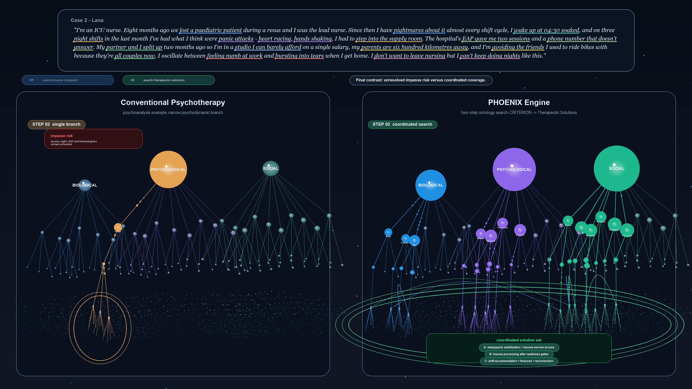

<div align="center">

# PHOENIX Case Demonstration

### A controlled two-step comparison between conventional psychotherapy and the PHOENIX Engine.

</div>

---

## Overview

This folder hosts the public motion-graphic demonstration of how the PHOENIX Engine differs from a conventional single-discipline psychotherapy workflow when both are given the **same free-text complaint**, the **same CRITERION variables**, and the **same five-layer Therapeutic-Solutions hierarchy** derived from the PHOENIX `PREDICTOR` ontology. The point of the demonstration is structural rather than rhetorical: conventional psychotherapy traditions are valuable and used for clear theoretical reasons; PHOENIX is positioned here as a complementary, breadth-first reasoning layer that systematically explores the full biopsychosocial candidate space before treatment selection.

The published video uses **Case 2 — Lana**, an ICU nurse whose complaint contains comorbid post-traumatic, anxiety, sleep, grief-spectrum, occupational, financial, and care-access signals. The case is intentionally complex so that the contrast between narrow-branch and breadth-first exploration becomes legible at thesis-figure scale.

---

## Demonstration Video

<div align="center">

<video controls width="100%" poster="renders/posters/lana_stepped_phoenix_comparison.png">
  <source src="https://github.com/stvsever/ThesisMaster/raw/main/src/backend/overview/video_material/renders/mp4/lana_stepped_phoenix_comparison.mp4" type="video/mp4">
</video>

**MP4:** [Watch / download the Lana demonstration](https://github.com/stvsever/ThesisMaster/raw/main/src/backend/overview/video_material/renders/mp4/lana_stepped_phoenix_comparison.mp4)

</div>



---

## What the video shows

### Step 1 — Operationalisation of the free-text complaint *(00:00 — 00:13)*

The complaint is rendered in full and then progressively underlined span by span. Each highlighted span is operationalised into a CRITERION variable — a leaf of the PHOENIX criterion ontology that names the underlying mental-health concept the span maps to. The same set of CRITERION cards appears on **both** panels, which is the controlled-experiment property of the demonstration: there is no information asymmetry at the input stage, so anything that diverges afterwards is the consequence of the search policy alone.

The cards include trauma re-experiencing, autonomic hyperarousal, cue-triggered panic, trigger-context avoidance, alternating numbing and flooding, relational-grief features, isolation, night-shift role conflict, financial precarity, and a service-access failure (the unanswered EAP line).

### Step 2 — Coordinated search through the Therapeutic-Solutions hierarchy *(00:13 — 00:36)*

Both panels now traverse the same five-layer hierarchy that PHOENIX assembles from the `PREDICTOR` ontology:

- **Layer 1** &nbsp;|&nbsp; Major branches *(BIO, PSYCHO, SOCIAL — and within conventional psychotherapy, the dominant theoretical branch)*
- **Layer 2** &nbsp;|&nbsp; Domain families *(Sleep & Circadian, Trauma Memory Work, Care Navigation, …)*
- **Layer 3** &nbsp;|&nbsp; Intervention classes *(Stabilisation & Resourcing, Distress-Tolerance Skills, Service Matching, …)*
- **Layer 4** &nbsp;|&nbsp; Concrete leaf-level candidates *(`Window_Of_Tolerance_Education`, `Trauma_Informed_Service_Option_Matching`, `Brief_Breath_Reset`, …)*
- **Layer 5** &nbsp;|&nbsp; Tiny unlabeled micro-options that make the depth of the search field visible without adding text clutter

The **left panel** shows a conventional psychodynamic / psychoanalytic-style traversal: it follows an interpretively coherent path through one well-understood theoretical branch — *transference exploration, defence identification, affect-defence interpretation* — and concludes with a single deep candidate. The path is not wrong, but it stays within one theoretical lineage. The closing card is a compact red **impasse-risk** annotation indicating that several criterion clusters have no candidate in the explored branch and therefore cannot be acted upon within this frame.

The **right panel** shows the PHOENIX BFS-3phase search: smaller moving particles traverse multiple branches in parallel, cross-branch arcs visualise the criterion-level dependencies that the search resolves jointly. Brief white narration captions appear and disappear across the video so the viewer can follow the algorithmic story at normal viewing speed: controlled input, criterion decomposition, shared hierarchy, narrow-path search, broad BPS search, gated coordination, and final contrast. The panel terminates with a compact **coordinated solution set** listing cross-branch candidates that together cover the full criterion deck.

---

## Reproducibility

The public repository stores the rendered MP4 and poster frame. The local renderer used to produce the video is kept out of the public tree while the thesis visuals are still being iterated.

```bash
src/backend/overview/video_material/renders/mp4/lana_stepped_phoenix_comparison.mp4
src/backend/overview/video_material/renders/posters/lana_stepped_phoenix_comparison.png
```

The public render is generated locally into `renders/mp4/`; see `.gitignore` in this folder for repository hygiene.

---

<div align="center">

*Part of the PHOENIX Engine — Personalised Hierarchical Optimization Engine for Navigating Insightful eXplorations.*

</div>
