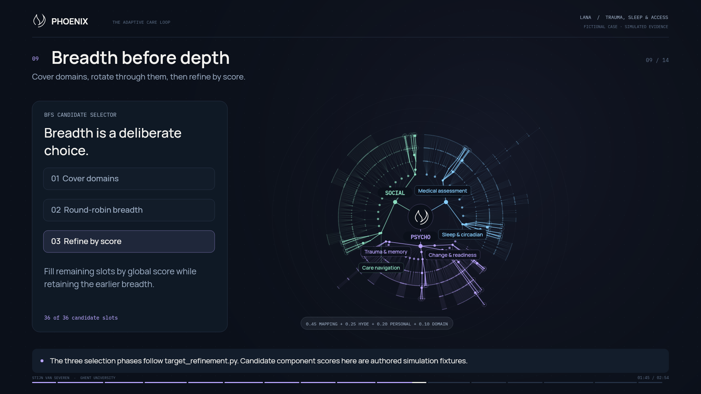

<div align="center">

# PHOENIX · The adaptive care loop

**Five people. Sixteen chapters. A complete journey from free-text complaint to a next step that can adapt.**

An interactive motion studio and five reproducible Full HD films by **Stijn Van Severen**.



</div>

## Open the studio

From this folder:

```sh
npm start
```

Open **[the local studio](http://127.0.0.1:4173)**. Starting the studio needs Node.js 20 or later and does not require installing the rendering dependencies. Alternatively, serve this folder with any static HTTP server. Open it over HTTP rather than double-clicking `index.html`, because the browser loads a local ontology snapshot and JavaScript modules.

The experience runs locally. It needs no account, API key, model call or external font service. The interface uses HTML, CSS and JavaScript, with a shared Canvas 2D engine for the live presentation and exported films.

## Watch the five films

Every full film is **1920 × 1080, 24 fps, 2 minutes 54 seconds**, with on-screen narrative captions. The MP4s are silent, ready for a live presentation or a separately recorded voice-over. Each tells the complete workflow through a different fictional case.

| Case                                    | What makes the story different                                            | Film                                                 | Storyboard                                                |
| --------------------------------------- | ------------------------------------------------------------------------- | ---------------------------------------------------- | --------------------------------------------------------- |
| **Lana, 34** · ICU nurse                | Trauma cues, rotating shifts, disrupted sleep and access to care          | [MP4](renders/mp4/lana_phoenix_full_workflow.mp4)    | [16 shots](renders/contact-sheets/lana_storyboard.jpg)    |
| **Maarten, 47** · warehouse coordinator | Persistent pain, activity avoidance, rumination and working conditions    | [MP4](renders/mp4/maarten_phoenix_full_workflow.mp4) | [16 shots](renders/contact-sheets/maarten_storyboard.jpg) |
| **Maya, 22** · university student       | Worry, study engagement, competing demands and a short observation record | [MP4](renders/mp4/maya_phoenix_full_workflow.mp4)    | [16 shots](renders/contact-sheets/maya_storyboard.jpg)    |
| **Noor, 41** · family caregiver         | Care demands, limited recovery time, practical support and feasibility    | [MP4](renders/mp4/noor_phoenix_full_workflow.mp4)    | [16 shots](renders/contact-sheets/noor_storyboard.jpg)    |
| **Elias, 68** · retired teacher         | Bereavement, meaning, connection, transport and low digital burden        | [MP4](renders/mp4/elias_phoenix_full_workflow.mp4)   | [16 shots](renders/contact-sheets/elias_storyboard.jpg)   |

## Direct the demonstration

The left control panel lets a presenter:

- Choose a case, jump to any chapter, scrub the film, change playback speed and loop playback.
- Switch between directed camera movement and manual pan/zoom in the hierarchy, ancestry and search chapters.
- Inspect BIO, PSYCHO or SOCIAL, reveal between 2 and 10 levels, and move from an essential sample to the full 7,265-leaf catalogue.
- Toggle labels, traversal particles, narrative captions and reduced motion.
- Compare psychodynamic branch focus, CBT branch focus and an integrative score-first example against the same breadth-first selector.
- Adjust the shared candidate budget and illustrative data readiness, then inspect the resulting selection, analysis tier and evidence weights.
- Change the cycle number to demonstrate simulated carry-over changes in personal anchors. These changes can move in either direction.
- Inspect exact candidate or node ancestry, save a 1080p PNG, export session data and provenance, or copy a URL to the current view.
- Open a presentation mode that gives the stage the available window space.

**Space** plays or pauses. **Left / right arrows** change chapter. **F** opens presentation mode, and **Escape** closes it. Keyboard-accessible candidate selection provides the same ancestry information as clicking a graph node.

The MP4 download always retrieves the published default case film. Changing controls changes the live demonstration and PNG/session exports. Use `--session` to render a saved configuration to a separate custom film. The rendered timeline keeps its original pacing; the playback-speed control is for live viewing.

## The complete story

| Time  | Chapter                | What becomes visible                                                          |
| ----- | ---------------------- | ----------------------------------------------------------------------------- |
| 00:00 | The person             | Case identity and the biopsychosocial constellation                           |
| 00:07 | Listen & separate      | The full complaint, exact highlighted spans, PERSON and CONTEXT               |
| 00:20 | Ground the meaning     | Decomposition, critic review, hybrid retrieval and CRITERION ancestry         |
| 00:31 | Reveal the hierarchy   | Real PREDICTOR branches and variable-depth structure                          |
| 00:43 | Follow one possibility | A camera move into one option and its complete parent-child lineage           |
| 00:53 | Build a first model    | HyDE-informed hypotheses, predictor-criterion links and actor-critic revision |
| 01:04 | Observe daily life     | Model-guided EMA and growing simulated time series                            |
| 01:14 | Respect the evidence   | Diagnostic readiness and tier-appropriate analytical complexity               |
| 01:24 | Estimate & prioritise  | Association networks or descriptive monitoring, plus illustrative impact      |
| 01:35 | Breadth before depth   | Domain coverage, round-robin breadth and score-based refinement               |
| 01:49 | Compare the search     | Identical input and candidate pool, with different search policies            |
| 02:01 | Select with scrutiny   | Ranked candidates, suitability, feasibility and critic checks                 |
| 02:11 | Update the model       | Readiness-weighted idiographic and nomothetic fusion                          |
| 02:21 | Make action possible   | HAPA phase, barrier, action plan, coping plan and delivery preview            |
| 02:35 | Remember & adapt       | Communication, history ledger and the next observation cycle                  |
| 02:47 | Keep learning          | The complete proposition and its scientific scope                             |

The [workflow notes](docs/workflow.md) map these shots to the actual repository architecture. The [design and storyboard notes](docs/design.md) explain the visual decisions and comparison assumptions. The [validation record](docs/validation.md) documents the checks and their limits.

## What is real, and what is illustrative

**Repository-derived:** the full PREDICTOR tree, its **7,265 leaves**, the observed maximum path depth of **10**, all **30 selected CRITERION paths**, all **40 featured PREDICTOR paths**, the three-phase candidate selection policy, the score coefficients, the readiness-weighting formula and the HAPA barrier coefficients. The snapshot records SHA-256 fingerprints for all five ontology sources.

**Authored for explanation:** the five people and complaints, concept-to-span choices, candidate relevance and impact values, criterion links, time series, network edges, critic dialogue, diagnostic values, illustrative readiness thresholds and HAPA plans. No PHOENIX runtime evaluation or patient treatment took place to produce these films. A CRITERION path identifies an ontology concept; it does not diagnose a disorder. This is particularly relevant to the grief and trauma examples.

The hierarchy contains actual stored parent-child relationships, with no fabricated depth or decorative micro-options. The default view samples the catalogue for legibility and explicitly reports the sample size. The full-catalogue option retains every leaf. Labels are shortened for display; the inspector retains complete paths.

The comparison demonstrates **search breadth, explicit context, traceability and an adaptive loop**. Counts describe the authored candidate links, not symptoms cured. Conventional psychotherapy can be integrative, multidisciplinary and adaptive. The integrative comparator makes that overlap visible. These films do not establish clinical superiority, exhaustive clinical coverage or treatment efficacy.

## Reproduce the outputs

Install the pinned rendering dependency and ensure FFmpeg is available:

```sh
npm ci
npm test
npm run render
npm run verify:media
```

The browser and MP4 renderer call the same scene functions. There is no screen capture, browser timing dependence, remote media or duplicate video implementation. Rendering samples explicit times, feeds raw frames to FFmpeg and writes a compatible H.264 MP4 with `yuv420p` and fast-start metadata.

Useful commands:

```sh
# One complete case
node scripts/render.mjs --case lana

# Posters, all storyboard sheets and local QA frames
node scripts/render.mjs --posters --qa

# Short preview for motion review
node scripts/render.mjs --case lana --from 31 --to 43 --width 1280 --fps 24

# Render the visual controls from a saved session to a separate custom film
node scripts/render.mjs --session /path/to/phoenix_lana_session.json

# Higher resolution, using the same vector-like scene geometry
node scripts/render.mjs --case lana --width 3840 --fps 24

# Rebuild and revalidate the repository-derived data snapshot
npm run data
```

The renderer writes completed films atomically, after FFmpeg succeeds. `renders/manifest.json` records the final dimensions, timing, frame count and case files. Short previews use separate filenames.

## Folder guide

```text
video_material/
├── index.html                  Interactive studio entry
├── app/
│   ├── app.js                  Controls, interaction and exports
│   ├── styles.css              Responsive studio interface
│   ├── model.js                Timeline, hierarchy and selection logic
│   └── renderer.js             Shared deterministic scene engine
├── assets/
│   ├── favicon.svg             Original vector mark
│   └── fonts/                  Locally served fonts and OFL licences
├── data/
│   ├── cases.authoring.json    Editable fictional cases and mapping queries
│   └── snapshot.json           Verified paths, full PREDICTOR tree and provenance
├── docs/                       Workflow, design and validation notes
├── scripts/                    Local server, data builder and video renderer
├── tests/                      Data, selection and all-scene verification
├── renders/
│   ├── mp4/                    Five complete films
│   ├── posters/                Full HD poster images
│   ├── contact-sheets/         One 16-shot storyboard per case
│   └── manifest.json           Output metadata
├── package.json
├── package-lock.json
└── README.md
```

This version replaces the earlier two-step renderer, storyboard and comparison films. Rendering code and case data are now included in the repository. Temporary QA frames and dependencies remain ignored.

Part of **PHOENIX**, Personalised Hierarchical Optimization Engine for Navigating Insightful eXplorations. See the [root stage map](../../../../README.md#end-to-end-stage-map).
