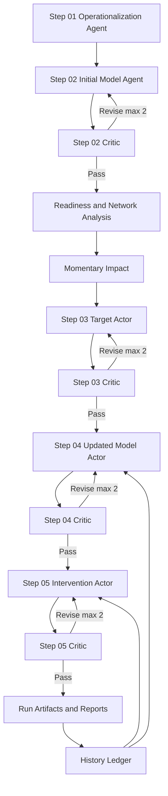

# PHOENIX Architecture Overview

## Executive Summary

PHOENIX is a multi-agent research system that integrates ontology-guided reasoning, idiographic time-series evidence, and intervention translation into a reproducible pipeline.

Core sequence:
1. operationalize complaints,
2. construct initial observation model,
3. quantify dynamic impact,
4. refine targets and updated model,
5. generate HAPA-aligned intervention,
6. preserve iterative lineage for subsequent cycles.

## Multi-Agent Flow

## Design Principles

- **Breadth-first solution search:** explore sibling predictor domains before deepening.
- **Nomothetic × idiographic fusion:** combine mapping priors and profile-specific evidence.
- **Guardrail reviews:** critic agents score quality and request bounded revisions.
- **Feasibility grounding:** parent-domain suitability signals are injected into model reviews.
- **Controlled ontology strictness:** default ontology-driven mode with optional hard constraints.

## Output Guarantees

Each stage emits:
- `stage.log` (human-readable)
- `stage_events.jsonl` (event trace)
- `stage_trace.json` (summary, timings, counts)

Major artifacts are schema-validated to preserve backward-compatible contracts.
