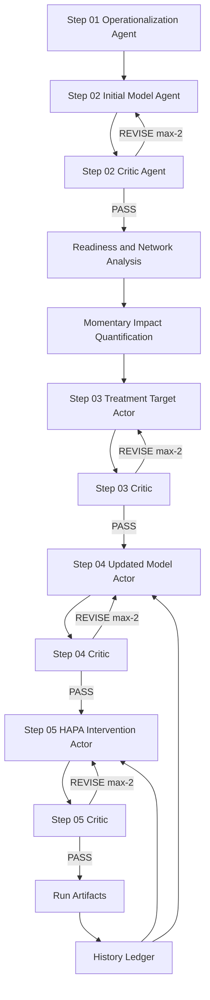

# PHOENIX Engine Overview

## 1) User-friendly summary

PHOENIX (**P**ersonalized **H**ierarchical **O**ptimization **E**ngine for **N**avigating **I**nsightful e**X**plorations) is a multi-agent system that:

1. translates free-text mental-health complaints into measurable criteria,
2. builds an initial observation model (criteria + predictors),
3. runs readiness-aware time-series analysis,
4. computes momentary impact scores,
5. selects/refines treatment targets with ontology-guided breadth-first search,
6. generates a HAPA-based digital intervention,
7. iteratively updates models while preserving run memory.

It is designed for research-grade transparency: every stage writes structured logs, trace files, and schema-validated artifacts.

## 2) Full multi-agent architecture

## 3) Core design logic

### 3.1 Breadth-first predictor search
- PHOENIX first explores plausible sibling solution domains before deepening.
- Candidate ranking uses mapping evidence, HyDe retrieval, and idiographic anchors.
- A temperature-aware candidate policy supports controlled exploration before exploitation.

### 3.2 Nomothetic × idiographic fusion (Step-04)
- Updated model ranking combines:
  - ontology/mapping priors (nomothetic),
  - observed impact from current profile (idiographic),
  - readiness-aware weighting.
- Iterative memory augments fusion with previous-cycle evidence and stability bonuses.

### 3.3 Critic-actor loops
- Each critic computes weighted composite quality scores.
- If score/critical-issue criteria are not met, critic sends actionable feedback.
- Actor revises output with critic feedback; max local iterations = 2.

### 3.4 Multi-domain feasibility grounding
- Critics consume predictor feasibility evidence from:
  - `src/utils/official/multi_dimensional_feasibility_evaluation/PREDICTORS/results/summary/predictor_rankings.csv`
- Parent-domain aggregates are derived and injected into critic evidence.

### 3.5 Ontology constraints
- Default: `hard_ontology_constraint = False` (ontology-driven but not hard-forced).
- Optional hard mode forces selected predictors/barriers/coping paths to ontology-matched nodes.

## 4) Dataflow and artifact guarantees

- Every stage emits:
  - `stage.log` (human-readable),
  - `stage_events.jsonl` (machine events),
  - `stage_trace.json` (timings, counts, contract checks).
- Contracts enforce stable schema compatibility for major outputs.
- Reports summarize method path, readiness rationale, LLM/fallback usage, and iterative memory lineage.

## 5) Operational modes

- **Single-cycle research run**: full 01→05 pass.
- **Iterative mode**: cycle-aware refinement (`--cycles`, history ledger, memory window).
- **LLM-enabled mode**: structured outputs with retry/repair taxonomy.
- **Fallback mode**: deterministic schema-valid outputs when provider unavailable.

## 6) Implementation map

- Agentic components: `src/SystemComponents/Agentic_Framework/`
- Time-series core: `src/SystemComponents/Hierarchical_Updating_Algorithm/`
- Ontology assets: `src/SystemComponents/PHOENIX_ontology/`
- Integrated evaluation orchestration: `Evaluation/00_pipeline_orchestration/`
